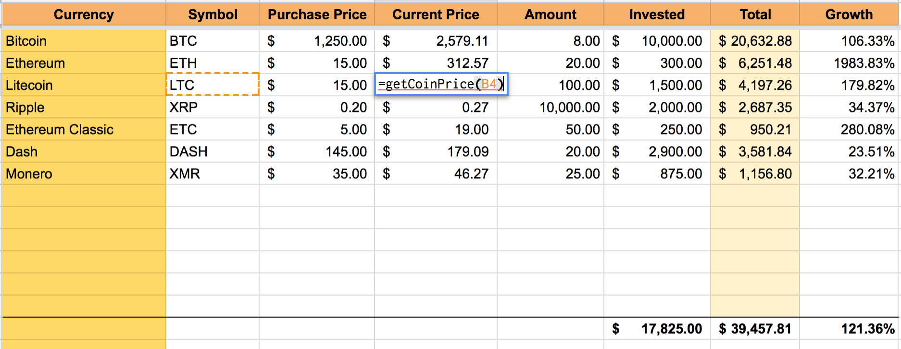

# Cryptocurrency Spreadsheet Utils

Useful cryptocurrency tools (like getting the current price, of Bitcoin, Ethereum) for Google Spreadsheets.

This is the utility script used in the Cryptocurrency Financial Spreadsheet:

https://docs.google.com/spreadsheets/d/1lnE260-F7TSs6onegSVYgRAP0ZZeuUy2YsfO2Ww_eJY/edit?usp=sharing

The easiest way to use it is to make a copy of the spreadsheet above.

You can also add the `CryptocurrencySpreadsheetUtils.gs` script in Tools > Script editor.

## Getting Coin Prices

Getting coin prices is really easy, just add =getCoinPrice("SYMBOL") in a row. For example, Bitcoin would be
    
    =getCoinPrice("BTC")
    
Ethereum would be

    =getCoinPrice("ETH")
    
Litecoin would be

    =getCoinPrice("LTC")       
 
Almost every crypto currency should work because data is fetched from CoinMarketCap.com's API.

Coinbin.org is also supported and can be used by specifying the second parameter, like this:

    =getCoinPrice("BTC", "coinbin")
    
If you want to use Coinbin by default you can edit it in the script. You can also add new API providers if Coinbin and CoinMarketCap don't have what you need.

## Getting Coin Attributes

Getting other attributes besides price is really easy too. To retrieve the current Litecoin rank from Coinbin:

    =getCoinAttr("LTC", "rank", "coinbin")

Or here's how to get the 24 hour volume of Ethereum from CoinMarketCap

    =getCoinAttr("ETH", "24h_volume_usd", "coinmarketcap")
    
Here is CoinMarketCap's full attribute list:

    {
        "id": "bitcoin", 
        "name": "Bitcoin", 
        "symbol": "BTC", 
        "rank": "1", 
        "price_usd": "3682.84", 
        "price_btc": "1.0", 
        "24h_volume_usd": "768015000.0", 
        "market_cap_usd": "61081971156.0", 
        "available_supply": "16585562.0", 
        "total_supply": "16585562.0", 
        "percent_change_1h": "-0.59", 
        "percent_change_24h": "-2.46", 
        "percent_change_7d": "1.0", 
        "last_updated": "1506297552"
    }
    
Here is Coinbin's full attribute list:

    {
        "btc": 1.00000000, 
        "name": "Bitcoin", 
        "rank": 1, 
        "ticker": "btc", 
        "usd": 3689.71
    }
    
## Updating data

Google Sheets caches data by default for a long time. To fix this, you must cache bust the function. This means adding some random number to the end of the =getCoin* functions. The `refresh()` function does this automatically.

There are two ways to use it:

1. The script has a cryptocurrency menubar that can run the refresh function. This requires special permissions from Google.
2. Add a drawing with an action on your spreadsheet that acts like a button. To insert a "button" use Insert > Drawing to draw your button and place it on your spreadsheet and then right click the button you just created and select the drop down menu and choose Assign Script and enter "refresh".

## Versions

- v0.6 — 12/13/2017 — Cleaned up code (thanks @jeromedalbert)
- v0.5 — 11/26/2017 — Fixed multi-coin issue by sorting coins (thanks @jeromedalbert)
- v0.4 — 11/09/2017 — Fixed limit with CoinMarketCap API reponses
- v0.3 — 09/24/2017 — Created pluggable API backends, added Coinbin API, cleaned up code & docs.
- v0.2 — 09/07/2017 — Added refresh() and getCoinAttr() functions by John Harding
- v0.1 — 06/29/2017 — Initial release
